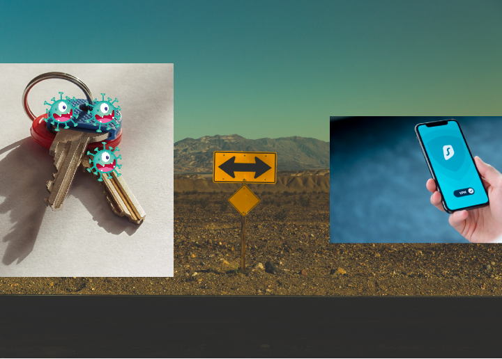
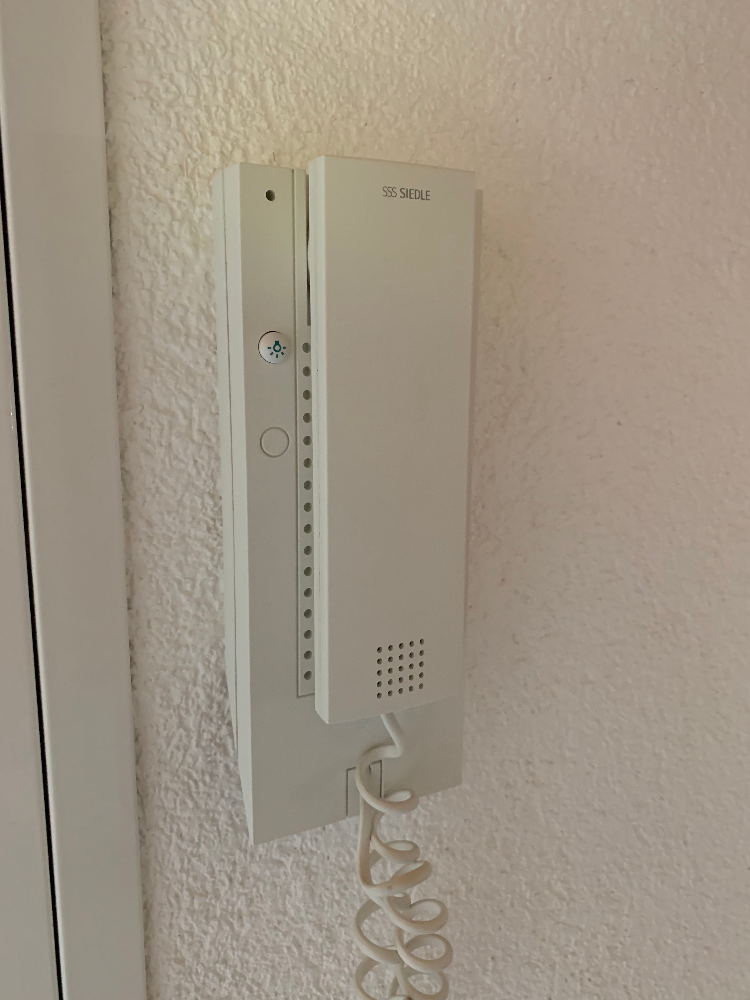
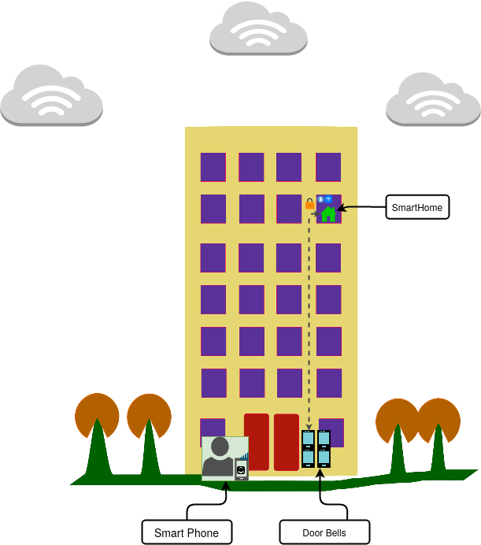
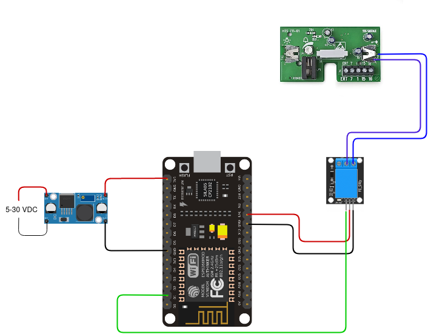
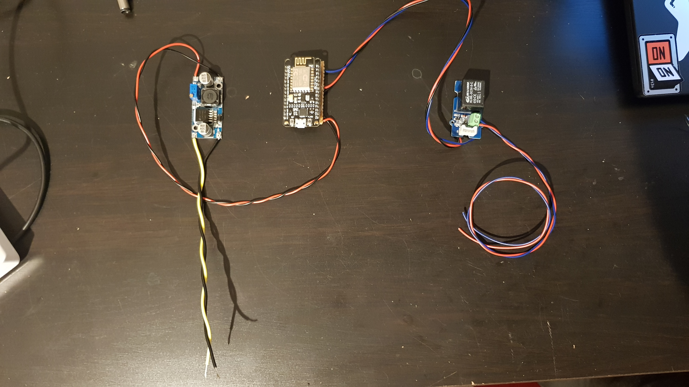
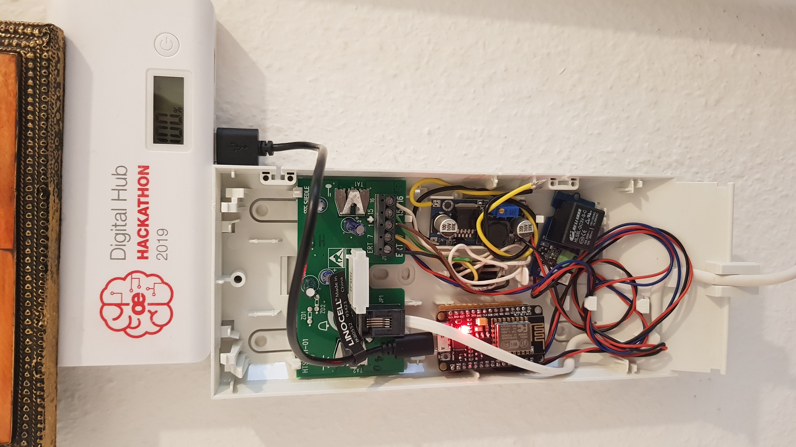
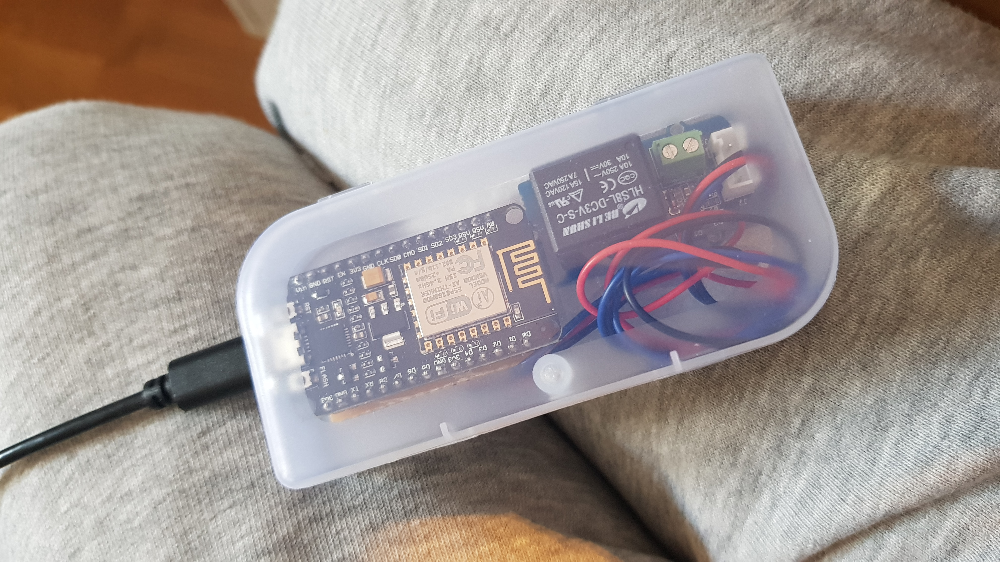
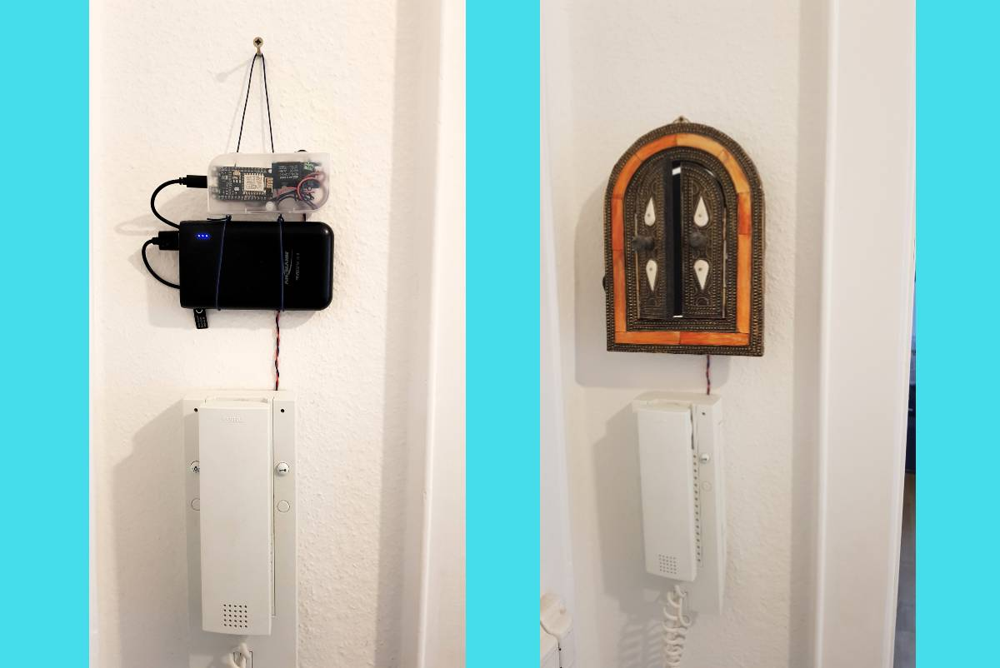
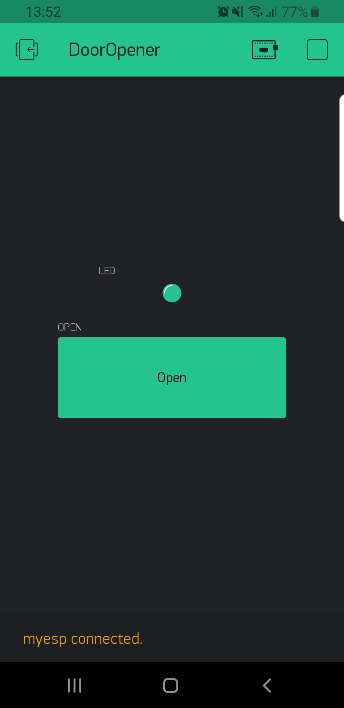

# Making your apartment lock smart 

> During the times of Covid-19, its time to make a contact-less door opener
> 
<table>
  <tr>
    <td>
      
    </td>
  </tr>
</table>

<!---
> Because GitHub's `README` styling is actually really nice
-->

## Background
Ever since we moved into our new apartment, we were handed over two keys to enter the apartment building. One key opens the main entry door of the building and another opens the home door on one of the floors of the building. The extra key to carry also comes with the fear of loosing it. This motivated me to connect the apartment lock to the Internet and open it without any contact. 
You might be thinking, why make it when such solutions already exists. For example, [Nello one](https://www.nello.io/en/) provided keyless entry system. The idea was very innovative with many applications but after about 4 years they filed for [insolvency in July 2019](https://medium.com/@christophbaumeister/why-nello-failed-bd5df7c2b0fb). So with Nello gone, I wanted to make my own key-less door opener and that is not as expensive as Nello was(~100€). 

## Problem
I want to open the door to enter inside my apartment without using the key to open the lock. The problem is replacing a mechanical door lock key with a digitally connected lock key. I could hack the intercom installed inside my apartment. Along with an intercom, I could use the button to open the door downstairs.

## Pre-requirements
This hack/project assumes that you have the following or similarly installed intercom system:
- An intercom system, which supports opening the door by pressing a physical button
- The intercom allows the door to be open by just pressing the open button, without lifting the intercom phone
- A smart phone with Internet connectivity (3G/Wifi)
- Internal or external source of power is present

<table>
  <tr>
    <td>
      
    </td>
  </tr>
</table>

## Requirements
Below are the requirements for the hack
- Able to open the door lock by using an application on the smart phone
- The time take to open the lock using the phone should be comparable to the time taken to open using the keys
- Heartbeat signal to show connectivity 
- Nice to have, if one can get notification in case of bell ring on the door
- Low power and being able to run for a longer period of time in case of battery powered
- Firmware updates over the air (OTA)

## Needed Hardware
Below is the hardware used
- ESP8266 with `ESP8266 core for Arduino`. [Development Kit](https://en.wikipedia.org/wiki/NodeMCU)
- Relay module 3V. [Grove Relay](http://wiki.seeedstudio.com/Grove-Relay/)
- Voltage regulator, in case of supply voltage higher then 9VDC. [LM2596 DC-DC regulator](https://www.seeedstudio.com/Adjustable-DC-DC-Power-Converter-1-25V-35V-3-p-1534.html)
- Opto-coupler (To get ring input)
- 330 ohm resistor
- NPN Transistor, if not using the relay approach [1]
- USB power bank, if not using internal supply

## How it works
1. A phone connected to the cloud sends a signal to the intercom at home
2. The phone send the message to open the door via the cloud
3. The ESP is connected to the cloud, get the message 
4. It operates the relay to open the door

## Solution
<table>
  <tr>
    <td>
      
    </td>
  </tr>
</table>

### Solution- Wifi
The Wifi based solution, is the first of many solutions. It uses ESP8266 board to connect directly to the Internet. For cloud connectivity, I have used Blynk.io. Blynk provides the cloud solution for IoT devices. It has the integrated App to control the GPIO of the ESP8266. 

### Circuit Diagram
<table>
  <tr>
    <td>
      
    </td>
  </tr>
</table>

<table>
  <tr>
    <td>
      
    </td>
  </tr>

  <tr>
    <td>
      
    </td>
  </tr>

  <tr>
    <td>
      
    </td>
  </tr>

  <tr>
    <td>
        I decided to move circuit out of the intercom
    </td>
  </tr>

  <tr>
    <td>
        
    </td>
  </tr>

  <tr>
    <td>
        Hidden away and neat ;)
    </td>
  </tr>
</table>

### Blynk.io IoT Cloud
One need to install the andriod app from [blynk.io](https://blynk.io/en/getting-started). Inside the app, it provides some free credits to add different features inside the app. I added a button and a virtual blinking led. After creating the app, it sends the Auth-token needed inside the firmware. The firmware/sketch can be generated from the link below: 
- [Example code generator](https://examples.blynk.cc/) 

<table>
  <tr>
    <td>
      
    </td>
  </tr>
</table>

### OTA firmware updates 
Once the ESP-8266 is installed inside the intercom. It should be possible to upload the firmware over the air. Luckily, it has been already implemented. Follow this link below to add this feature. 
 [ESP8266 Over The Air (OTA) Programming In Arduino IDE](https://lastminuteengineers.com/esp8266-ota-updates-arduino-ide/)

### Source Code
The source code is located inside the `esp8266_src/sketch`.
Edit the source before uploading to the board.
```
// You should get Auth Token in the Blynk App.
// Go to the Project Settings (nut icon).
char auth[] = "ADD_AUTH_TOKEN_HERE";

// Your WiFi credentials.
// Set password to "" for open networks.
char ssid[] = "ADD_WIFI_SSID_HERE";
char pass[] = "ADD_WIFI_PASSKEY_HERE";
```

### Issues
After looking at the multiple Internet forums to look for the wiring diagram for my intercom. I could only find a few links in German language. It pin-outs for the HTS-711 01.

<table>
  <tr>
    <th>
      Pin Name
    </th>
    <th>
      Function
    </th>
  </tr>
  <tr>
    <td>
      ERT
    </td>
    <td>
      Signal to indicate a ring bell
    </td>
  </tr>
  <tr>
    <td>
      7 
    </td>
    <td>
      Positive volts (12-24 VDC)
    </td>
  </tr>
    <tr>
    <td>
      1
    </td>
    <td>
      Negative or Ground
    </td>
  </tr>
  <tr>
    <td>
      15
    </td>
    <td>
      Monitor signal
    </td>
  </tr>
  <tr>
    <td>
      16
    </td>
    <td>
      Monitor signal
    </td>
  </tr>
</table>

The voltage between the Pin-1 and Pin-7 range from 12-24 Volts DC but they have very limited current available ~ 15mA. This is not enough to driver the ESP module along with the phone. As soon the ESP is powered, the phone stops working. One solution is to use a USB power bank to power the device and charge it every now and then. 
### Security
Note: This solutions is not built for a secure application, although its possible to add security features. Such as [signed firmware updates](https://arduino-esp8266.readthedocs.io/en/latest/ota_updates/readme.html).

### Solution- BLE 
With the powerful Wifi ESP module, it is time to move to a greener and more energy friendly solution. Blue-tooth Low Energy provides low power connectivity and suits better for such a situation. It will have the following components
- BLE module e.g. nrf52840 
- Transistor logic instead of relay to save more energy
- Gateway to connect the BLE device to the Internet e.g. A Raspi

## Links and References and Acknowledgments
- Ejaad-Nama, a is newsletter. which cover different technology news. Please, subscribe [here](https://ejaadnama.substack.com/)
- [Adding OTA updates to the ESP-8266 modules](https://lastminuteengineers.com/esp8266-ota-updates-arduino-ide/) 
- [German Thread about the siedle intercom lock system](https://forum.iobroker.net/topic/7660/siedle-klingel-t%C3%BCr%C3%B6ffner-mit-esp8266-und-mqtt/39) [1]
- https://forum.iobroker.net/assets/uploads/files/1574673353705-siedle-spannungen-anmerkung-2019-11-18-100717.png 
- [On-line photo editor](https://pixlr.com/)
- [Draw.io](https://app.diagrams.net/) 
- https://pixabay.com/vectors/building-tall-housing-houses-48626/
- https://github.com/audef1/magicdooropener 
- http://androidcontrol.blogspot.com/2015/05/arduino-wifi-control-with-esp8266-module.html
- https://forum.fritzing.org/t/lm2596-step-down-module/6380 
- https://arduinomodules.info/ky-019-5v-relay-module/
- https://images-na.ssl-images-amazon.com/images/I/61kBdGlWCzL._SX679_.jpg 
- This `README` [template](https://github.com/KrauseFx/markdown-to-html-github-style) helped me alot to quickly write this document
## The Next Step
### Make a BLE version and use no relay
<!---
## Patreon 
-->

##### Buy me a toilet roll/hand sanitizers or a Mask. Else a coffee, if we are out of corona times ;) 
[](https://www.paypal.me/aqeelarshad19)


[](https://www.linkedin.com/in/aqeelarshad19/)
<!---
<h3 style="text-align: center; font-size: 35px; border: none">
  <a href="https://github.com/KrauseFx/markdown-to-html-github-style" target="_blank" style="text-decoration: none;">
    🔰 Open GitHub page 🔰
  </a>
</h3>
-->
